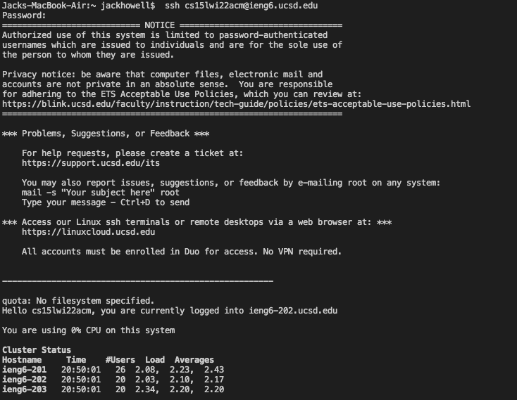
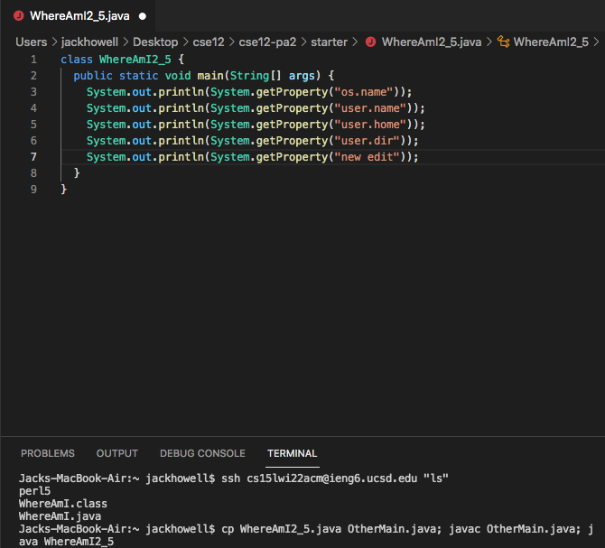

# Lab Report 1
## Week 2

## Installing VScode

* Using this [(Download Link)](https://code.visualstudio.com/) you will go to the website and choose to download the software. This can be done by clicking the download button in the top right cornner or midlle of the screen.
## Remotely Connecting

* Make sure you have OpenSSH installed if you are runnign the windows operatign system. Next find your UCSD or other access code for UCSD users it will look like this ```cs15lwi22zz@ieng6.ucsd.edu``` however the (zz) will be different. Then enter it into the comand line and type in your passowrd and you should see somthign similair to the screen Shot.
## Trying Some Commands

* While your romatly connected test out some comand like , ```cd```, ```ls```, ```pwd```, ```mkdir```, and ```cp```.
## Moving Files with scp

* Next try moving files with with the scp comand. First logout then from your client run the following in the terminal ```scp FileName.java cs15lwi22zz@ieng6.ucsd.edu:~/``` .
## Setting an SSH Key

*  To make the ssh key will be usefull as you will not have to use your password everytime you go into the remote server. Do this by using the ssh-keygen. It should end up using looking like the screen shot.
## Optimizing Remote Running

* Once you have the SSH key set up you can run commands from the client directly onothteh server the a command example is in the Screen shot above.



* After final optimztion hav taken place I was able to ```ssh cs15lwi22@ieng6.ucsd.edu ls ``` and ```cp WhereAmI.java OtherMain.java; javac OtherMain.java; java WhereAmI``` all in ten key strokes and 3 mouse clicks. This was possible because of the early steps that enabled my to not have to use my pasword on my local device when connecting to the server. 

[Back To Home Page](https://jrhowell123.github.io/cse15l-lab-reports/)