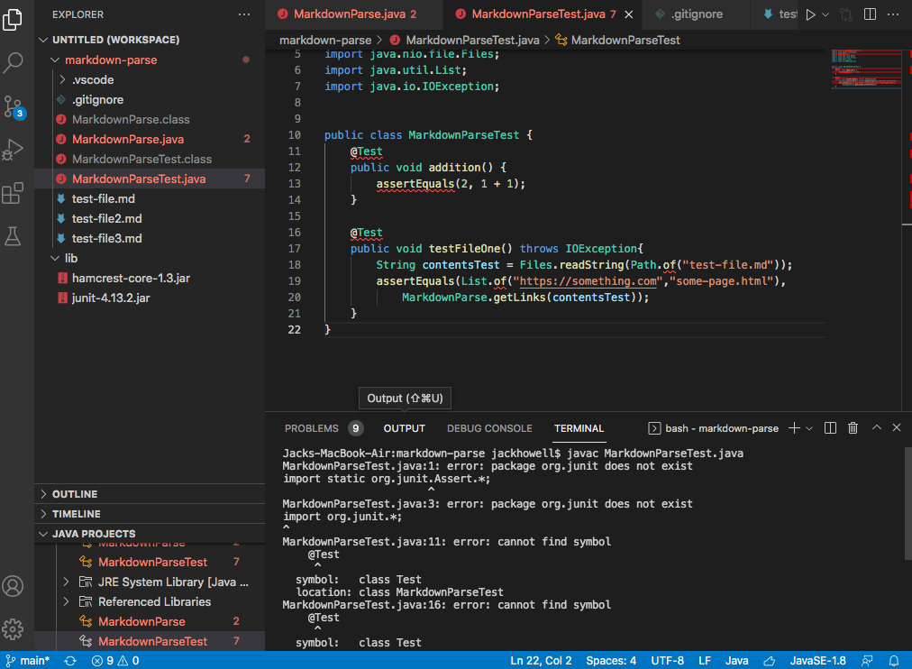

# Lab Report 2
## Week 4

## Bug-Fix1

[Failure-Inducing Input](https://github.com/jwong1209/markdown-parse/commit/3db631064210f7c6cb9297e75a14b27b0decb97c)
## Symptom

* This was a bug discovered by one of my group mates. The failer inducing point was when the class was shown to be working incorectly. The symptom shown by this bug was that the their was a gap and the link did not come through correctly.

## Bug-Fix1

[Failure-Inducing Input](https://github.com/jwong1209/markdown-parse/blob/main/imageGivenFix.png)
## Symptom

* This was a bug discovered by one of my group mates. The failer inducing point was when the loop woudl not close. The symptom shown by this bug was that the their was an infinte loop created.

## Bug-Fix1

[Failure-Inducing Input](https://github.com/jrhowell123/markdown-parse/tree/main/lib)
## Symptom

* I found this bug while coding during lab 4. The failer inducing point was rather then copying in the Lib reposiorty I was adding it the the work space. This showed the symptom of not letting me compile the coretlie the Junit tests we were workign on.

[Back To Home Page](https://jrhowell123.github.io/cse15l-lab-reports/)