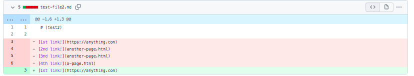
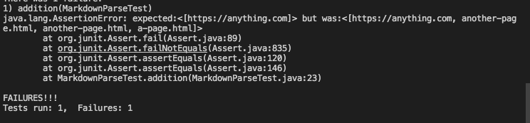
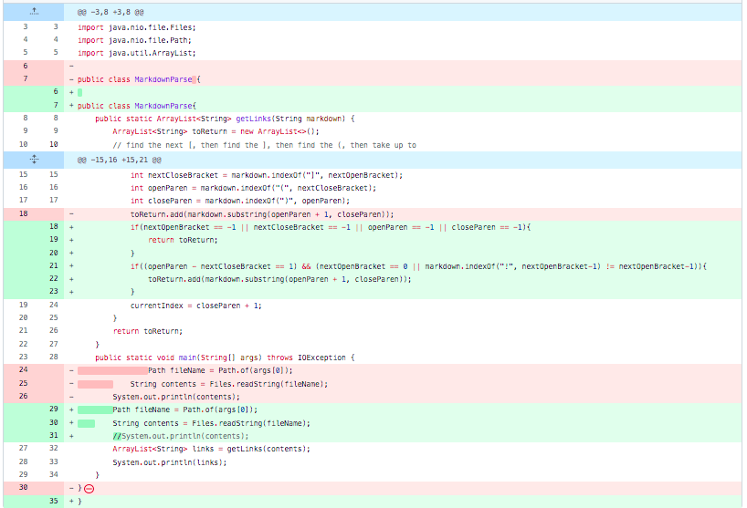
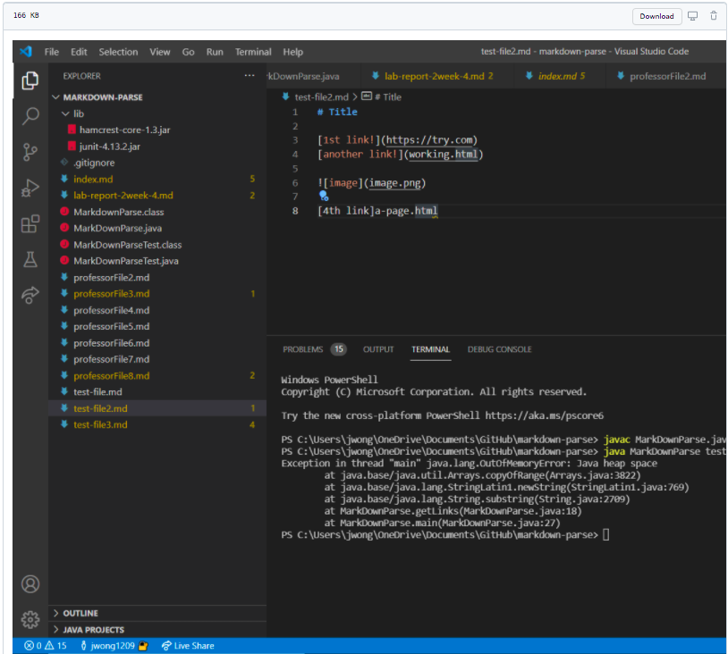
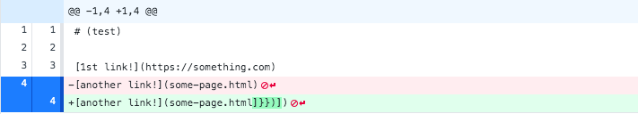
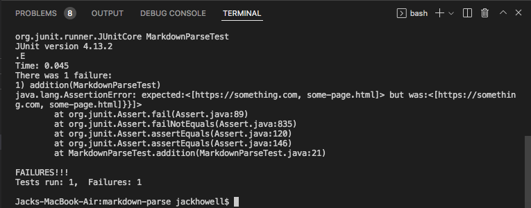

# Lab Report 2
## Week 4

## Bug-Fix1

[Failure-Inducing Input](https://github.com/jrhowell123/markdown-parse/commit/bd82b3058be96255f438d6e0a88fe50f8a2ab8fa)
## Symptom

* The symptom that that was seen was an error in the tester. This revealed the bug and failure inducing input that was casuing this symptom. The issue that was seen was that their was unruly amount of parenthesis that was not letting the MarkdownParse read the file link correctly. This was fixed by correctign the statemetn ot have one open parenthesis and one closed parenthesis.

## Bug-Fix2

[Failure-Inducing Input](https://github.com/jrhowell123/markdown-parse/commit/2e8a86150bc3562427b4c57aabe6de0256acf06b)
## Symptom

* The symptom that was seen was a compile issue. The bug and failure inducing input were then revealed to be a infinite while loop. This was fixed by adding cluases in the form of ```if``` statements that caught the edge cases that were causing the loop to go infinite.

## Bug-Fix3

[Failure-Inducing Input](https://github.com/jrhowell123/markdown-parse/commit/bd82b3058be96255f438d6e0a88fe50f8a2ab8fa)
## Symptom

* The symptom that was seen was a failer of the test. The bug and failure inducing input were then revealed to be an issue with checking for and having diifernt links. This was fixed by making sure the test file had the correct links so that the MarkdownParseTest would be able to properly test each link.

[Back To Home Page](https://jrhowell123.github.io/cse15l-lab-reports/)