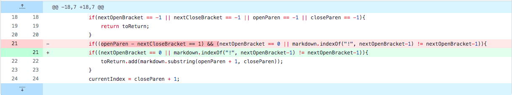
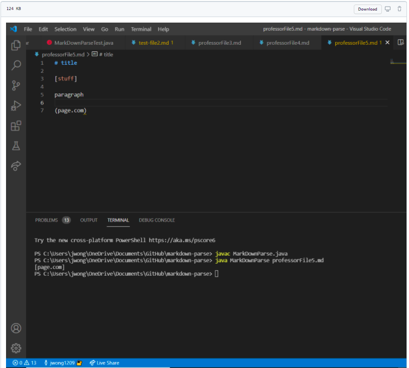
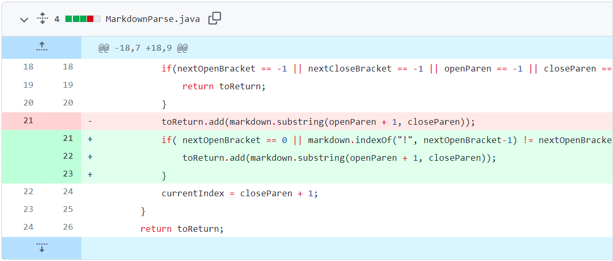

# Lab Report 2
## Week 4

## Bug-Fix1

[Failure-Inducing Input](https://github.com/jwong1209/markdown-parse/commit/3db631064210f7c6cb9297e75a14b27b0decb97c)
## Symptom

* gap not link

## Bug-Fix1

[Failure-Inducing Input](https://github.com/jwong1209/markdown-parse/blob/main/imageGivenFix.png)
## Symptom

* infintie while loop

## Bug-Fix1

[Failure-Inducing Input](https://github.com/jwong1209/markdown-parse/blob/main/imageGivenFix.png)
## Symptom

* infintie while loop