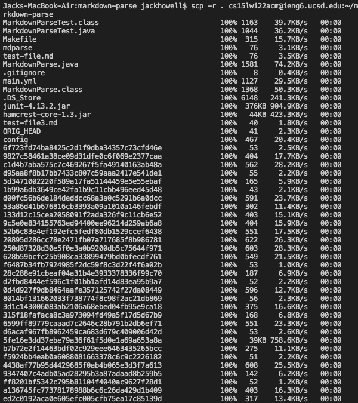
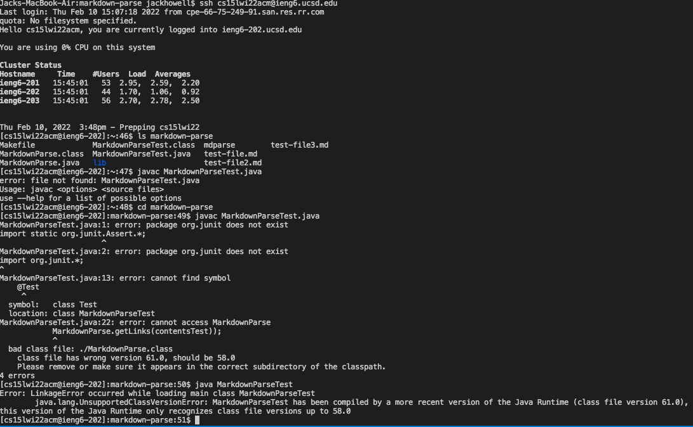
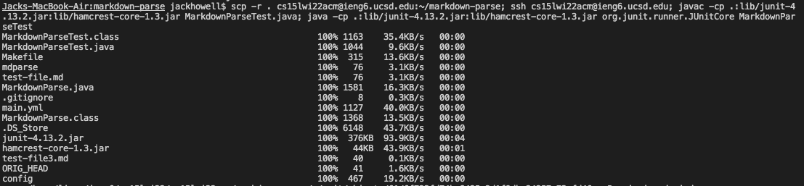
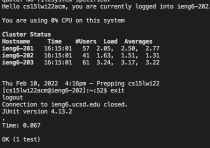

# Lab Report 3
## Week 6

## Copy Whole Directories with ```scp -r```


## Markdown-parse directory to ieng6

* Usaully adding files in a large directory to a remote server would be tedious as you would have to ```scp``` each one into the remote severe. However with certain commands you can do this quiclky taking advatage of recursion. The command is ```scp -r . cs15lwi22@ieng6.ucsd.edu:~/markdown-parse``` (of course with your own user name) the ```-r ``` represents  the recursive element of the program and the ```.``` repsresnt the current directory you want to copy over. 

## Running Newly Coppied Tests

* In this example you can see what it looks like when the recursion is running and copying everything to the remote server. If you look closely I try to compile the tests on the remote server and it fails why might this be? If you guessed that it was that I didnt compile using the lib that contains the Junit necessities you would be correct. In the next example you will see how this done correctly using right comannds.(```javac -cp .:lib/junit-4.13.2.jar:lib/hamcrest-core-1.3.jar MarkdownParseTest.java```, ```//java -cp .:lib/junit-4.13.2.jar:lib/hamcrest-core-1.3.jar org.junit.runner.JUnitCore MarkdownParseTest```)

## Combining ```scp```, ```;```, and ```ssh``` for Optimization 


* In this next example we see a way to optimize this whole process doing int in one line. Using this lien of code ( ```scp -r . cs15lwi22zzz@ieng6.ucsd.edu:~/markdown-parse; ssh cs15lwi22acm@ieng6.ucsd.edu; javac -cp .:lib/junit-4.13.2.jar:lib/hamcrest-core-1.3.jar MarkdownParseTest.java; java -cp .:lib/junit-4.13.2.jar:lib/hamcrest-core-1.3.jar org.junit.runner.JUnitCore MarkdownParseTest```) we are able to submit the directoy recursively then automatically compile it and run it passign the test cases. the key to this is using the ```;``` as it allows for mutiple comands in one line.

[Back To Home Page](https://jrhowell123.github.io/cse15l-lab-reports/)