# Lab Report 4
## Week 8


## Code Snippets
* Code Snippet #1
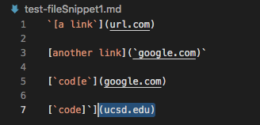
* Code Snippet #2
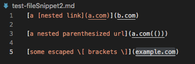
* Code Snippet #3
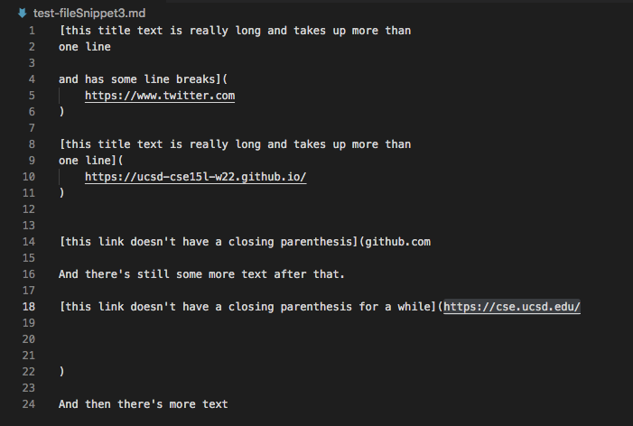
## Snippet 1,2,3 My Groups Implementation of Markdown-parse
* New tests added to Markdown-parse Test class
* Snippet #1 Test
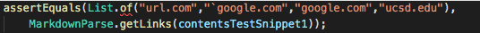
* Snippet #2 Test
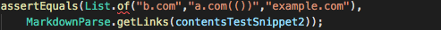
* SNippet #3 Test
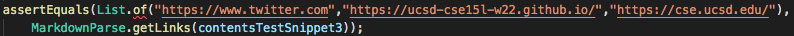
* Output after compling and running
* Snippet #1 Output

 Since the Code passes the output will look like this 

 ```url.com google.com google.com ucsd.edu ```
* Snippet #2 Output

Since the Code passes the output will look like this 

```b.com a.com example.com ```
* Snippet #3 Output
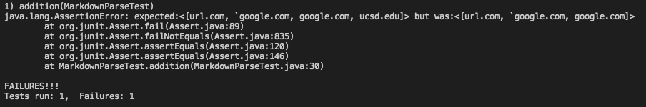
* For the implementation that me and my group have been working we passed all the tests except the third test snippet. We failed the lastcode snippet as seen in the Junit test.

## Snippet 1,2,3 Reviewed Markdown-parse
* New tests added to Markdown-parse Test class

* Code Snippet #1
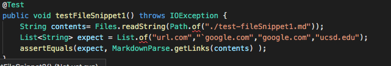
* Code Snippet #2
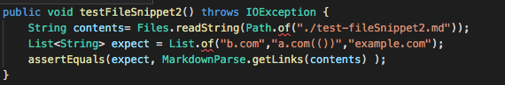
* Code Snippet #3
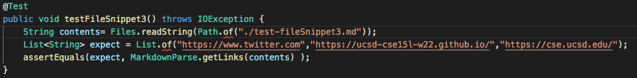
* Output after compling and running
* Snippet #1 Output
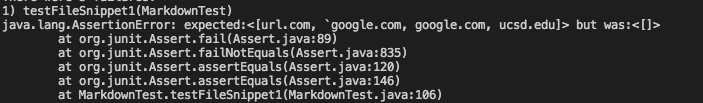
* Snippet #2 Output
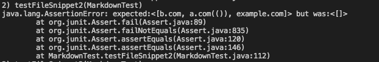
* Snippet #3 Output
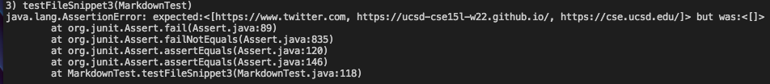
* For the implementation that me and my group reviewd  none of the new code snippet testswhere passed. As seen in the Junit tests all things neew code snippets failed.

* Question1: This test case was passed for my group's implementation For the reviewed code I believe that it would take alot of reworking and is not just a simple issue.
* Question2:This test case was passed for my group's implementation For the reviewed code I believe that it would take alot of reworking and is not just a simple issue. 
* Question3: For the third code snippet that we fialed i bielved if we included a coupels lins to take care of the spaces btween the pratheiss we could fix the issue. For the reviewed ode i bielve that it woudl take alot of reworkign and is not just a simple issue.

[Reviewed Markdown-parse](https://github.com/yayajjiang/markdown_inperson)


[Back To Home Page](https://jrhowell123.github.io/cse15l-lab-reports/)