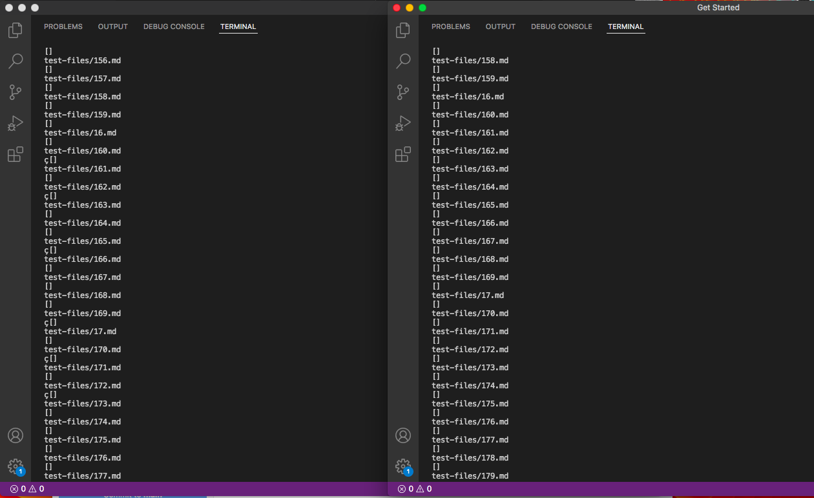

# Lab Report 5
## Week 10

## Way of parsing through differences

* I ended up jsut parsing through the lists of tests side by side. Thogh this was not he most effecincetn way I was able to be confident in makign sure I found difrences.

## Did not find any diferences
* I could not find any diferneces throgh the code and this strange to me but lokign through all the terms nothign cam back differnt. This could be due to aer code coverign the same cases and failing to the same

[Back To Home Page](https://jrhowell123.github.io/cse15l-lab-reports/)